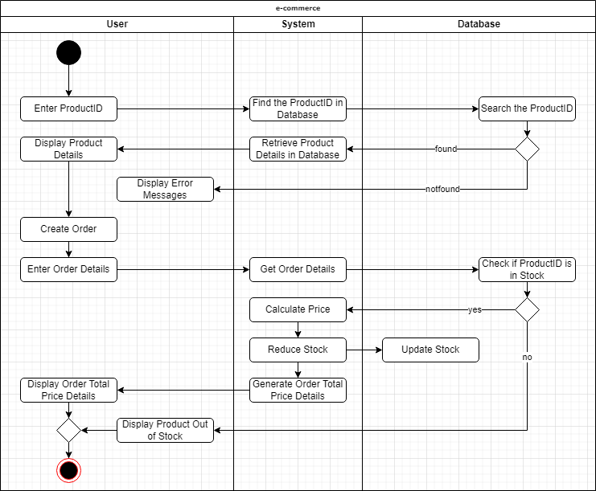

# E-commerce Design Assignment

## High Level Design



The diagram depicted above provides a simple perspective of a basic e-commerce system using an activity diagram. It illustrates the procedure of displaying detail product to the user and create an order for the chosen product.

## Create Order Details

```pseudocode
// Get the product by ID, check if the product is in stock

function createOrder(productID, quantity) {
  let totalprice = 0;
  for (productID in database) {
    let product = database.getProductById(productID);

    if (product.stock >= quantity) {
    product.stock -= quantity;
    totalprice += product.price * quantity;
    database.updateProductById(productID, product);
    order.push({
      "name": product.name,
      "quantity": quantity,
      "price": product.price,
    });
    }

    else {Print("Product out of stock.");
    }
  
  return {
    "totalPrice": totalPrice,
    "order": order
  };
}
```
